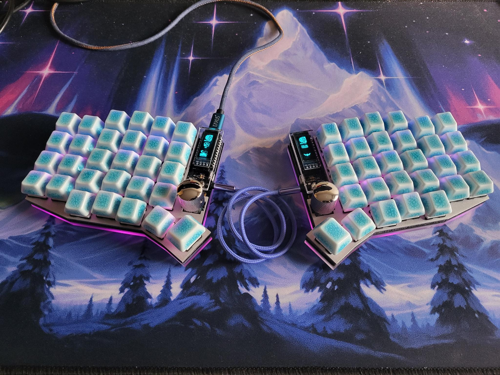
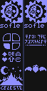

# Ergonomic and mnemonic keymap for writing code and stuff.
The keymap and some fancy effects for my keyboard (Aurora Sofle v2 from Splikb, not sponsored).

**Warning!** This is a personal project, I might make undocumented breaking changes at any time and offer no support.

## Install
This project uses QMK's userspace feature to define the keymap and effects. Check out the instructions found in this [repo](https://github.com/qmk/qmk_userspace).

## Keymap

The sent codes support host layouts 'German QWERTZ' and 'US QWERTY', the current mode can be toggled at any time.

'SWITCH MODE' toggles between modes:
- German QWERTZ host (4 layers)
- US QWERTY host (4 layers)
- Gaming (1 layer)

### Features
- Colemak letter distribution.
- Symbols are arranged to make common characters and groups (e.g. '->', '>=', '<=', ':='...) easiest to type.
- Semantically similar symbols are grouped.
- 'Mute' and 'Media Play' buttons are rotary encoders with (cw, ccw) actions bound to (Volume Up/Down) and (Page Up/Down) respectively.
- German Dead Keys (´, ^, `) are also availible as regular keys on the symbol layer.
- German special characters (ä, ö, ü, ß) are easy to access.
- Characters that are supposed to be accessed with shift (- _) (' ") (, ;) (. :) give the same results on both host layouts.
- Layer with arrow keys can be locked for prolonged navigation without holding a key.
- Host Layout can be toggled between 'German QWERTZ' and 'US QWERTY' for compatibility
  - German special characters and features are not available in 'US QWERTY' mode
- Special layer for gaming without rebinding controls
  - Essentially QWERTY, but shifted one key to the right, as WASD would be very uncomfortable otherwise.

## OLED Displays

- The four quarter circles display the current layer.
- The symbols beneath them show (left to right, top to bottom)
  - Shift
  - Layout
  - Alt
  - Super
  - Caps Lock
  - Ctrl
- The Celeste animation on the master side can be toggled to instead play the entire Bad Apple animation!
  - There is a flag to exclude it from compilation, the frames take more space then the rest of the firmware and effects combined...

## RGB Matrix effect
Custom effect composed of Starlight (value pulses with random phase offset) and vertically hue shifting at half frequency in a limited hue range, centered on blue.

## Source files
The [Pixelorama](https://pixelorama.org/) source files of the artworks on the OLED displays are included [here](assets), as well as the [script](assets/png2bytes.py) to turn the exported png into a C style array.
